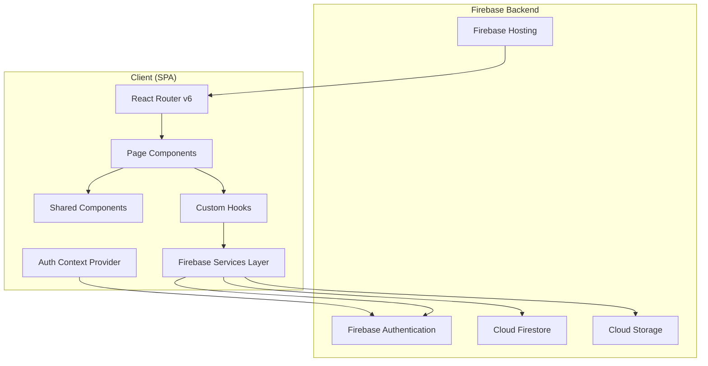
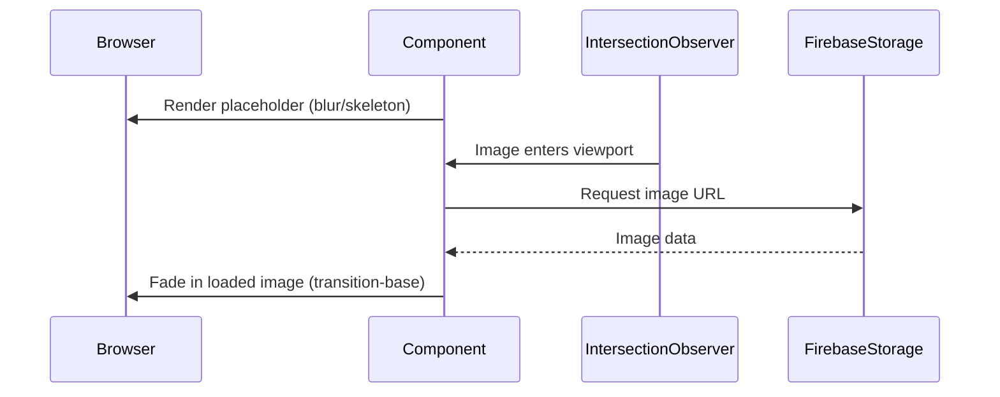
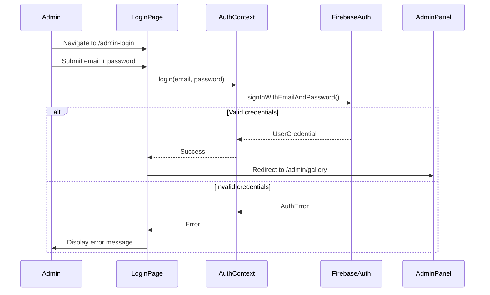
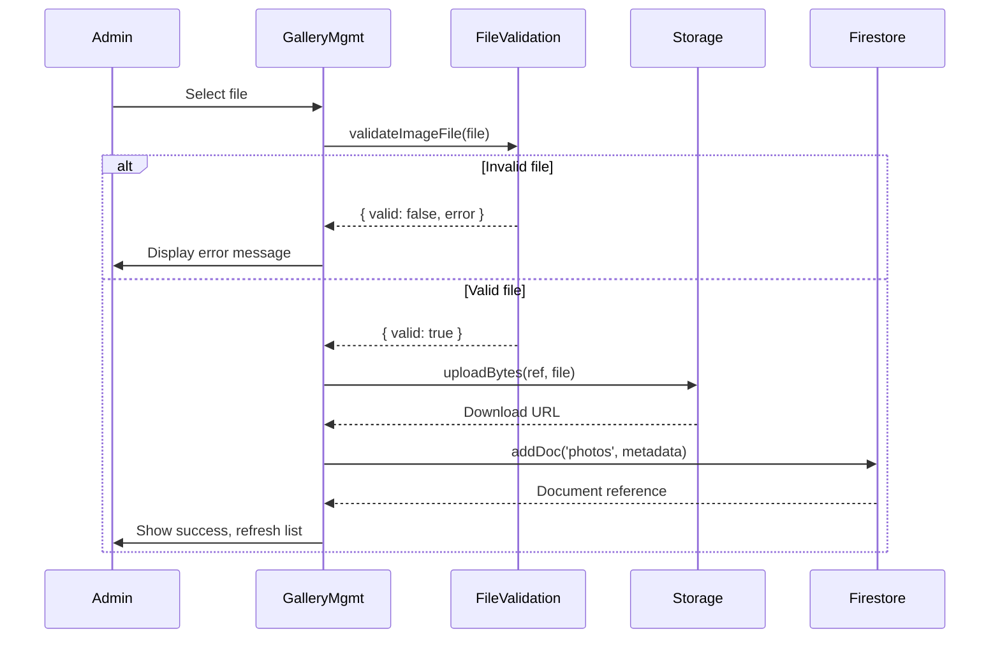

# Design Document: Photographer Site Refactor

## Overview

This design describes the complete rebuild of the Esteban Argerich photographer portfolio as a modern, performant single-page application. The new app will be scaffolded from scratch in a separate workspace (`Esteban-Argerich-New`) using Vite + React 18 + TypeScript, replacing the legacy Create React App setup.

The architecture prioritizes:
- **Performance**: Vite for fast builds, code splitting via lazy routes, WebP images, progressive loading
- **Maintainability**: TypeScript, CSS Modules for scoped styling, feature-based folder structure
- **Simplicity**: Firebase as a unified backend (Auth, Firestore, Storage, Hosting)
- **Mobile-first design**: All layouts designed for mobile then enhanced for larger viewports

### Key Technical Decisions

| Decision | Choice | Rationale |
|----------|--------|-----------|
| Build tool | Vite 5+ | Near-instant HMR, native ESM, fast production builds via Rollup |
| Language | TypeScript | Type safety, better DX, self-documenting interfaces |
| Styling | CSS Modules + CSS custom properties | Scoped styles without runtime cost, design tokens via variables |
| UI library | None (custom components) | Minimalistic design requires full control; no MUI overhead |
| Firebase SDK | v10+ modular | Tree-shakeable, smaller bundles |
| Routing | React Router v6 | Already familiar, lazy loading support |
| State management | React Context + hooks | Sufficient for auth state and simple data fetching |
| Testing | Vitest + React Testing Library + fast-check | Fast, Vite-native test runner with PBT support |

---

## Architecture

### High-Level Architecture Diagram



### Project Structure

```
Esteban-Argerich-New/
├── index.html
├── vite.config.ts
├── tsconfig.json
├── firebase.json
├── .firebaserc
├── package.json
├── public/
│   └── favicon.ico
├── src/
│   ├── main.tsx                    # Entry point
│   ├── App.tsx                     # Root component with router
│   ├── routes.tsx                  # Lazy route definitions
│   ├── assets/
│   │   └── logo.png               # Photographer signature/logo
│   ├── components/
│   │   ├── Navigation/
│   │   │   ├── Navigation.tsx
│   │   │   └── Navigation.module.css
│   │   ├── Footer/
│   │   │   ├── Footer.tsx
│   │   │   └── Footer.module.css
│   │   ├── Lightbox/
│   │   │   ├── Lightbox.tsx
│   │   │   └── Lightbox.module.css
│   │   ├── ImageCard/
│   │   │   ├── ImageCard.tsx
│   │   │   └── ImageCard.module.css
│   │   ├── WorkshopCard/
│   │   │   ├── WorkshopCard.tsx
│   │   │   └── WorkshopCard.module.css
│   │   ├── ProtectedRoute/
│   │   │   └── ProtectedRoute.tsx
│   │   ├── LoadingSkeleton/
│   │   │   ├── LoadingSkeleton.tsx
│   │   │   └── LoadingSkeleton.module.css
│   │   └── ConfirmDialog/
│   │       ├── ConfirmDialog.tsx
│   │       └── ConfirmDialog.module.css
│   ├── pages/
│   │   ├── Home/
│   │   │   ├── Home.tsx
│   │   │   └── Home.module.css
│   │   ├── Gallery/
│   │   │   ├── Gallery.tsx
│   │   │   └── Gallery.module.css
│   │   ├── Workshops/
│   │   │   ├── Workshops.tsx
│   │   │   └── Workshops.module.css
│   │   ├── About/
│   │   │   ├── About.tsx
│   │   │   └── About.module.css
│   │   ├── Login/
│   │   │   ├── Login.tsx
│   │   │   └── Login.module.css
│   │   └── Admin/
│   │       ├── AdminLayout.tsx
│   │       ├── AdminLayout.module.css
│   │       ├── GalleryManagement/
│   │       │   ├── GalleryManagement.tsx
│   │       │   └── GalleryManagement.module.css
│   │       └── WorkshopManagement/
│   │           ├── WorkshopManagement.tsx
│   │           └── WorkshopManagement.module.css
│   ├── hooks/
│   │   ├── useAuth.ts
│   │   ├── useFirestore.ts
│   │   ├── useStorage.ts
│   │   └── useMediaQuery.ts
│   ├── services/
│   │   ├── firebase.ts             # Firebase app initialization
│   │   ├── auth.ts                 # Auth service functions
│   │   ├── galleryService.ts       # Gallery CRUD operations
│   │   └── workshopService.ts      # Workshop CRUD operations
│   ├── context/
│   │   └── AuthContext.tsx
│   ├── utils/
│   │   ├── fileValidation.ts       # File type/size validation
│   │   └── imageOptimization.ts    # WebP detection, URL helpers
│   ├── types/
│   │   ├── gallery.ts
│   │   ├── workshop.ts
│   │   └── auth.ts
│   └── styles/
│       ├── global.css              # CSS reset, custom properties, base styles
│       └── tokens.css              # Design tokens (colors, spacing, typography)
└── tests/
    ├── components/
    ├── pages/
    ├── utils/
    │   └── fileValidation.test.ts
    └── properties/
        ├── fileValidation.property.test.ts
        ├── workshopCard.property.test.ts
        └── workshopForm.property.test.ts
```

### Routing Architecture

```mermaid
graph LR
    subgraph "Public Routes"
        Home[/ - Home]
        Gallery[/gallery - Gallery]
        Workshops[/workshops - Workshops]
        About[/about - About]
    end

    subgraph "Auth Route"
        Login[/admin-login - Login]
    end

    subgraph "Protected Routes"
        AdminGallery[/admin/gallery - Gallery Mgmt]
        AdminWorkshops[/admin/workshops - Workshop Mgmt]
    end

    Login -->|Auth Success| AdminGallery
    AdminGallery -.->|ProtectedRoute Guard| Login
    AdminWorkshops -.->|ProtectedRoute Guard| Login
```

All page components are loaded via `React.lazy()` to enable code-splitting:

```typescript
// routes.tsx
import { lazy } from 'react';

export const Home = lazy(() => import('./pages/Home/Home'));
export const Gallery = lazy(() => import('./pages/Gallery/Gallery'));
export const Workshops = lazy(() => import('./pages/Workshops/Workshops'));
export const About = lazy(() => import('./pages/About/About'));
export const Login = lazy(() => import('./pages/Login/Login'));
export const AdminLayout = lazy(() => import('./pages/Admin/AdminLayout'));
```

---

## Components and Interfaces

### Navigation Component

```typescript
// components/Navigation/Navigation.tsx
interface NavigationProps {}

// Internal state
// - isMenuOpen: boolean (hamburger menu toggle)
// - Listens to scroll position for fixed header behavior

// Behavior:
// - Renders links: Home, Gallery, Workshops, About
// - Below 768px: collapses into hamburger menu with slide animation
// - At/above 768px: inline horizontal layout
// - Fixed position at top of viewport
```

### Lightbox Component

```typescript
interface LightboxProps {
  images: GalleryImage[];
  currentIndex: number;
  isOpen: boolean;
  onClose: () => void;
  onNavigate: (index: number) => void;
}

// Behavior:
// - Full-screen overlay displaying selected image at high resolution
// - Close via X button or Escape key
// - Traps focus within lightbox for accessibility
// - Prevents body scroll while open
```

### ImageCard Component

```typescript
interface ImageCardProps {
  image: GalleryImage;
  onClick: () => void;
  loading?: 'lazy' | 'eager';
}

// Behavior:
// - Renders image with blur-up placeholder while loading
// - Uses IntersectionObserver for lazy loading
// - Displays placeholder skeleton until image loads
// - Triggers onClick to open lightbox
```

### WorkshopCard Component

```typescript
interface WorkshopCardProps {
  workshop: Workshop;
}

// Behavior:
// - Renders card with: title, description, date, location, cover image
// - Responsive: single column on mobile, grid on desktop
```

### ProtectedRoute Component

```typescript
interface ProtectedRouteProps {
  children: React.ReactNode;
}

// Behavior:
// - Checks auth state via AuthContext
// - If authenticated: renders children
// - If not authenticated: redirects to /admin-login
// - Shows loading state while auth state is being determined
```

### ConfirmDialog Component

```typescript
interface ConfirmDialogProps {
  isOpen: boolean;
  title: string;
  message: string;
  onConfirm: () => void;
  onCancel: () => void;
}

// Behavior:
// - Modal overlay with confirmation message
// - Two action buttons: confirm and cancel
// - Traps focus, closes on Escape
```

### Auth Context

```typescript
interface AuthContextValue {
  user: User | null;
  loading: boolean;
  login: (email: string, password: string) => Promise<void>;
  logout: () => Promise<void>;
}

// Provides authentication state to the entire app tree
// Wraps Firebase Auth onAuthStateChanged listener
```

### Custom Hooks

```typescript
// useAuth.ts - consumes AuthContext
function useAuth(): AuthContextValue;

// useFirestore.ts - generic Firestore collection hook
function useFirestore<T>(collectionName: string): {
  data: T[];
  loading: boolean;
  error: Error | null;
  refresh: () => void;
};

// useStorage.ts - Firebase Storage upload hook
function useStorage(): {
  uploadFile: (file: File, path: string) => Promise<string>;
  deleteFile: (path: string) => Promise<void>;
  uploading: boolean;
  progress: number;
};

// useMediaQuery.ts - CSS breakpoint hook
function useMediaQuery(query: string): boolean;
```

### Service Layer

```typescript
// services/galleryService.ts
interface GalleryService {
  getAll(): Promise<GalleryImage[]>;
  add(file: File): Promise<GalleryImage>;
  remove(id: string): Promise<void>;
}

// services/workshopService.ts
interface WorkshopService {
  getAll(): Promise<Workshop[]>;
  create(data: WorkshopFormData): Promise<Workshop>;
  update(id: string, data: Partial<WorkshopFormData>): Promise<Workshop>;
  remove(id: string): Promise<void>;
}

// services/auth.ts
interface AuthService {
  signIn(email: string, password: string): Promise<UserCredential>;
  signOut(): Promise<void>;
  onAuthChange(callback: (user: User | null) => void): Unsubscribe;
}
```

### File Validation Utility

```typescript
// utils/fileValidation.ts
interface FileValidationResult {
  valid: boolean;
  error?: 'FILE_TOO_LARGE' | 'UNSUPPORTED_FORMAT';
}

const ALLOWED_FORMATS = ['image/jpeg', 'image/png', 'image/webp'];
const MAX_FILE_SIZE_BYTES = 10 * 1024 * 1024; // 10MB

function validateImageFile(file: { size: number; type: string }): FileValidationResult;
```

---

## Data Models

### Firestore Collections

#### `photos` Collection

```typescript
interface GalleryImage {
  id: string;                    // Firestore document ID
  url: string;                   // Firebase Storage download URL
  storagePath: string;           // Storage path for deletion
  uploadedAt: Timestamp;         // Upload timestamp
  width?: number;                // Image width (for masonry layout)
  height?: number;               // Image height (for masonry layout)
}
```

**Firestore document structure:**
```json
{
  "url": "https://firebasestorage.googleapis.com/...",
  "storagePath": "gallery/abc123.webp",
  "uploadedAt": "<Timestamp>",
  "width": 1920,
  "height": 1280
}
```

#### `workshops` Collection

```typescript
interface Workshop {
  id: string;                    // Firestore document ID
  title: string;                 // Workshop title
  description: string;           // Workshop description
  date: Timestamp;               // Workshop date
  location: string;              // Workshop location
  coverImageUrl: string;         // Firebase Storage download URL
  coverImagePath: string;        // Storage path for deletion
  active: boolean;               // Whether to show on public page
  createdAt: Timestamp;          // Creation timestamp
  updatedAt: Timestamp;          // Last update timestamp
}
```

**Firestore document structure:**
```json
{
  "title": "Landscape Photography Masterclass",
  "description": "Learn techniques for capturing stunning landscapes...",
  "date": "<Timestamp>",
  "location": "Buenos Aires, Argentina",
  "coverImageUrl": "https://firebasestorage.googleapis.com/...",
  "coverImagePath": "workshops/cover-xyz.webp",
  "active": true,
  "createdAt": "<Timestamp>",
  "updatedAt": "<Timestamp>"
}
```

### Firebase Storage Structure

```
/gallery/
  ├── {uuid}.webp          # Gallery images (converted or original)
  ├── {uuid}.jpg
  └── ...
/workshops/
  ├── cover-{uuid}.webp    # Workshop cover images
  └── ...
```

### Form Data Types

```typescript
interface WorkshopFormData {
  title: string;
  description: string;
  date: string;              // ISO date string from form input
  location: string;
  coverImage: File | null;   // New cover image (null if not changing)
}
```

### Firestore Security Rules (Design Intent)

```
rules_version = '2';
service cloud.firestore {
  match /databases/{database}/documents {
    // Public read access for gallery and workshops
    match /photos/{photoId} {
      allow read: if true;
      allow write: if request.auth != null;
    }
    match /workshops/{workshopId} {
      allow read: if true;
      allow write: if request.auth != null;
    }
  }
}
```

### Storage Security Rules (Design Intent)

```
rules_version = '2';
service firebase.storage {
  match /b/{bucket}/o {
    match /gallery/{fileName} {
      allow read: if true;
      allow write: if request.auth != null
                   && request.resource.size < 10 * 1024 * 1024
                   && request.resource.contentType.matches('image/(jpeg|png|webp)');
    }
    match /workshops/{fileName} {
      allow read: if true;
      allow write: if request.auth != null
                   && request.resource.size < 10 * 1024 * 1024
                   && request.resource.contentType.matches('image/(jpeg|png|webp)');
    }
  }
}
```

---

## Correctness Properties

*A property is a characteristic or behavior that should hold true across all valid executions of a system — essentially, a formal statement about what the system should do. Properties serve as the bridge between human-readable specifications and machine-verifiable correctness guarantees.*

### Property 1: File upload validation correctly classifies all files

*For any* file metadata object with a size (0 to 100MB) and a MIME type string, the `validateImageFile` function SHALL return `{ valid: true }` if and only if the file size is ≤ 10MB AND the MIME type is one of `image/jpeg`, `image/png`, or `image/webp`. For all other inputs, it SHALL return `{ valid: false }` with the appropriate error code (`FILE_TOO_LARGE` or `UNSUPPORTED_FORMAT`).

**Validates: Requirements 5.5, 5.6, 5.7**

### Property 2: Workshop card renders all required fields

*For any* valid Workshop object (with non-empty title, description, date, location, and coverImageUrl), the rendered WorkshopCard output SHALL contain the title text, description text, formatted date, location text, and an image element referencing the cover image URL.

**Validates: Requirements 6.2**

### Property 3: Workshop edit form pre-fills all fields from data

*For any* valid Workshop object, when the edit form is initialized with that workshop's data, every form field SHALL contain the corresponding workshop value (title in title input, description in description textarea, date in date input, location in location input).

**Validates: Requirements 7.3**

---

## Error Handling

### Authentication Errors

| Scenario | Handling |
|----------|----------|
| Invalid credentials | Display inline error message below form: "Invalid email or password" |
| Network error during login | Display error: "Unable to connect. Please check your internet connection" |
| Session expired | Redirect to login page with message: "Session expired, please log in again" |
| Unauthorized admin access attempt | Redirect to login page silently |

### File Upload Errors

| Scenario | Handling |
|----------|----------|
| File exceeds 10MB | Display error inline: "File size exceeds the 10MB limit" |
| Unsupported format | Display error inline: "Only JPEG, PNG, and WebP formats are supported" |
| Upload network failure | Display error with retry option: "Upload failed. Please try again" |
| Storage quota exceeded | Display error: "Storage limit reached. Please contact support" |

### Data Fetching Errors

| Scenario | Handling |
|----------|----------|
| Firestore read failure | Display error state with retry button |
| Empty collection (gallery) | Display gallery page with no images (blank masonry grid) |
| Empty collection (workshops) | Display message: "No workshops are currently scheduled" |
| Image load failure | Display broken-image placeholder; do not break masonry layout |

### General Error Boundary

A React Error Boundary wraps the app at the route level to catch unhandled rendering errors and display a fallback UI with a "Return to Home" option.

---

## Testing Strategy

### Testing Stack

- **Test runner**: Vitest (Vite-native, fast, compatible with Jest API)
- **Component testing**: React Testing Library
- **Property-based testing**: fast-check
- **Accessibility testing**: axe-core via vitest-axe

### Unit Tests (Example-Based)

Unit tests cover specific examples, edge cases, and integration points:

- **Navigation**: Renders all 4 links, hamburger appears at mobile viewport, menu toggle works
- **Lightbox**: Opens on image click, closes on Escape/button, traps focus
- **Gallery**: Renders correct column count per breakpoint, shows skeletons during load
- **Workshop Cards**: Renders with mock data, shows empty state message
- **Auth flow**: Login success redirects, login failure shows error, logout clears state
- **ProtectedRoute**: Redirects unauthenticated users, renders children for authenticated
- **Admin panels**: List/create/edit/delete flows with mocked Firebase services
- **Footer**: Renders copyright with current year, social links open in new tab

### Property-Based Tests

Property tests verify universal correctness properties using fast-check (minimum 100 iterations each):

| Property | Test File | Validates |
|----------|-----------|-----------|
| File validation classifies all inputs correctly | `fileValidation.property.test.ts` | Req 5.5, 5.6, 5.7 |
| Workshop card renders all required fields | `workshopCard.property.test.ts` | Req 6.2 |
| Workshop edit form pre-fills all fields | `workshopForm.property.test.ts` | Req 7.3 |

**Configuration**:
- Each property test runs a minimum of 100 iterations
- Each test is tagged with a comment: `// Feature: photographer-site-refactor, Property {N}: {title}`
- Generators produce randomized but valid domain objects (Workshop, File metadata)

### Integration Tests

Integration tests verify Firebase service interactions with emulators:

- Gallery service: upload → Firestore doc created with correct URL
- Gallery service: delete → Storage file removed + Firestore doc deleted
- Workshop service: CRUD lifecycle (create, read, update, delete)
- Auth service: sign in, auth state changes, sign out

### Accessibility Tests

- All pages pass axe-core automated checks (WCAG 2.1 AA)
- Manual testing recommended for screen reader flows and keyboard navigation

### Performance Testing

- Lighthouse CI check in build pipeline (target: Performance > 90)
- Bundle size monitoring via Vite build output

---

## Design System Tokens

The design system is implemented via CSS custom properties in `src/styles/tokens.css`:

```css
:root {
  /* Colors — max 3 primary + white + black */
  --color-primary: #1a1a1a;        /* Near-black for text */
  --color-secondary: #4a4a4a;      /* Dark gray for secondary text */
  --color-accent: #8b7355;         /* Warm tone for accents */
  --color-white: #ffffff;
  --color-black: #000000;
  --color-background: #fafafa;     /* Off-white background */
  --color-surface: #ffffff;        /* Card/surface background */
  --color-error: #d32f2f;          /* Error states */

  /* Typography — single sans-serif family */
  --font-family: 'Inter', -apple-system, BlinkMacSystemFont, sans-serif;
  --font-size-xs: 0.75rem;
  --font-size-sm: 0.875rem;
  --font-size-base: 1rem;
  --font-size-lg: 1.25rem;
  --font-size-xl: 1.5rem;
  --font-size-2xl: 2rem;
  --font-size-3xl: 3rem;

  /* Spacing — generous whitespace, min 48px between sections */
  --space-xs: 8px;
  --space-sm: 16px;
  --space-md: 24px;
  --space-lg: 48px;
  --space-xl: 64px;
  --space-2xl: 96px;

  /* Transitions — between 200ms and 400ms */
  --transition-fast: 200ms ease;
  --transition-base: 300ms ease;
  --transition-slow: 400ms ease;

  /* Breakpoints (reference only, used in media queries) */
  --bp-mobile: 768px;
  --bp-desktop: 1200px;

  /* Shadows */
  --shadow-sm: 0 1px 3px rgba(0, 0, 0, 0.08);
  --shadow-md: 0 4px 12px rgba(0, 0, 0, 0.1);
  --shadow-lg: 0 8px 24px rgba(0, 0, 0, 0.12);

  /* Border radius */
  --radius-sm: 4px;
  --radius-md: 8px;
  --radius-lg: 12px;
}
```

### Responsive Breakpoints

| Breakpoint | Width | Layout behavior |
|------------|-------|-----------------|
| Mobile | < 768px | Single column, hamburger nav, stacked layouts |
| Tablet | 768px – 1199px | 2-column gallery, multi-column workshops |
| Desktop | ≥ 1200px | 3-column gallery, full inline nav, side-by-side layouts |

### Image Loading Strategy



---

## Admin Authentication Flow



## Image Upload Pipeline


